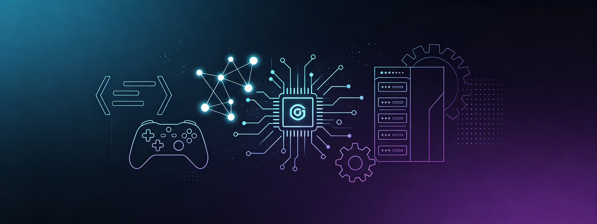

<div align="center">



[](https://github.com/Helianthusay7)

</div>

---

### 👋 About Me

```
const me = {
  focus: ["Game Dev", "AI Agent", "Backend", "Fullstack"],
  learning: ["Cocos2d-x", "Python", "Java", "OS", "AI Apps"],
  currently: "Building games & agents",
  askMeAbout: ["game dev", "ai agents", "system design"],
  funFact: "I break things to understand how they work",
};
```

### 🛠️ Tech Stack

```
┌─ Languages ──────────────────────────────────────────┐
│  C   C++   Python   Java   JavaScript   TypeScript  │
├─ Game & Graphics ────────────────────────────────────┤
│  Cocos2d-x   OpenGL                                  │
├─ Backend & Infra ────────────────────────────────────┤
│  Node.js   Spring   MySQL   Redis   Docker   Linux  │
├─ Frontend ───────────────────────────────────────────┤
│  React   Vue   HTML5   CSS3                          │
└───────────────────────────────────────────────────────┘
```

### 🌱 Currently Learning

| Area | What |
|------|------|
| 🎮 Game Engine | **Cocos2d-x** — cross-platform game development |
| 🤖 AI | **AI Agent** design & LLM-powered applications |
| ⚙️ Systems | **Computer fundamentals** — architecture & OS internals |
| ☕ Languages | **Python** (AI/scripting) · **Java** (backend) |

### 📫 Get in Touch

<div align="center">

[](mailto:lchi46124@gmail.com)
[](https://github.com/Helianthusay7)

</div>

---

<div align="center">

```diff
+ "Still learning, still shipping."
```

🚀 Helianthusay7 · 2026

</div>
